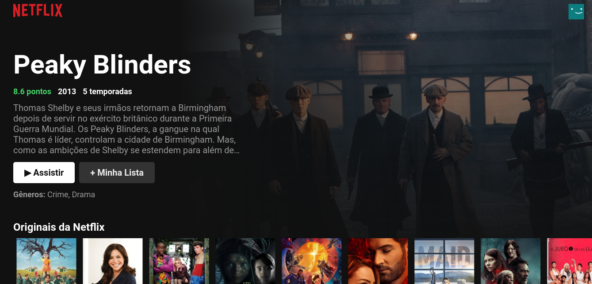

[netflixclone](https://affectionate-newton-dfe167.netlify.app/)
======================================================================================

A Netflix frontend clone made in React for studying purposes only.

Used technologies
-----------------

*   The application consumes an [API](https://developers.themoviedb.org/3/getting-started/introduction) to get movies info and images.
*   **React used in the frontend**

Features
--------

### Functional requirements

*   List featured movie (large Hero)
*   List movies in a scrollable showcase

### Non functional requirements

*   Simple API consumption
*   Use React for the frontend
  

Screens
-------

### Home

Requirements
------------

*   Node.js
*   Internet connection
*   Internet browser
*   A terminal emulator

How to run
----------

*   Download the project from GitHub
*   Extract project folder if needed
*   Go to the project folder and open a terminal emulator (Gnome Terminal, CMD...)
*   Type 'npm start' and hit enter

### or

[Click-me!](https://affectionate-newton-dfe167.netlify.app/)

### Credits

All images rights goes to Netflix
---------------------------------

Movies info taken from  [The Movie Database](https://developers.themoviedb.org/3/getting-started/introduction)
--------------------------------------------
